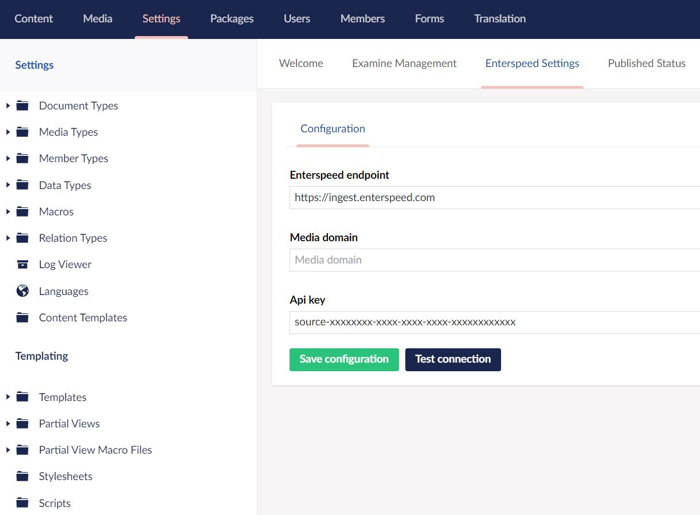

# Configuring Umbraco with Enterspeed

Guide for how to configure Umbraco to call Enterspeed Ingest API.

## Source API key and Ingest endpoint

For the Enterspeed Ingest to work, a Source must be created at Enterspeed and you should have been provided an Ingest endpoint.  
So before moving on, make sure you have a Source API key and Ingest endpoint from Enterspeed.  
**If you don't have these yet, please contact us at: [info@enterspeed.com](info@enterspeed.com)**

## Setting up the configuration

When ready, then follow these steps:

1. Go to the Umbraco backoffice and then go to _Settings_
2. Click _Enterspeed Settings_
3. In _Enterspeed endpoint_: insert the Enterspeed endpoint provided to you
4. In _Api key_: insert the Source API key
5. (optional) if you have a different image CDN or domain, other than the current Umbraco URL, provide it in: _Media domain_
6. Click on _Test connection_ and make sure you get a "Connection succeeded" and then click on _Save configuration_

### The result

So in the end, you will have something like this

