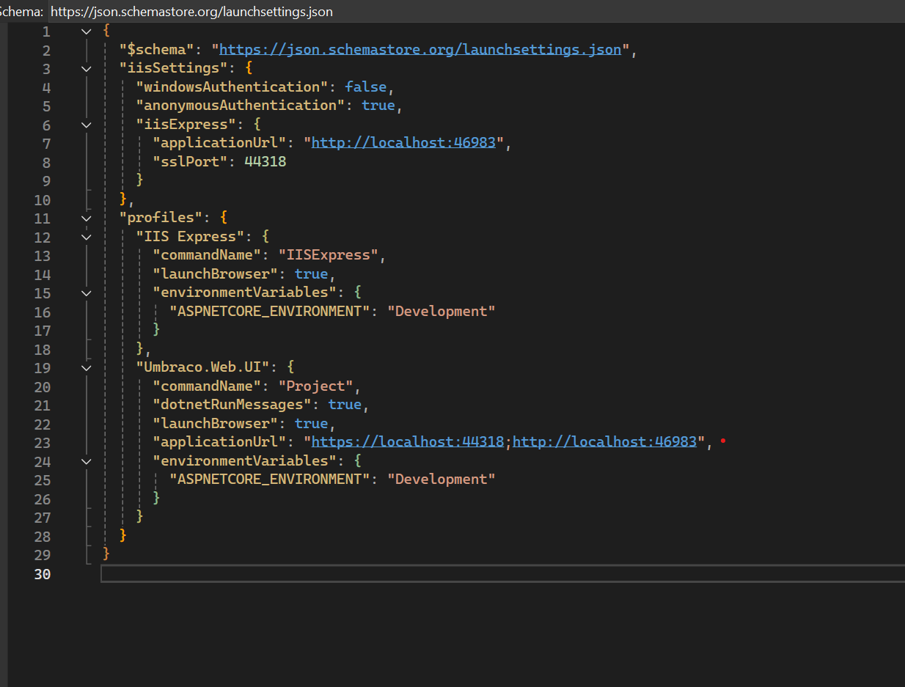

## Installation

1. Open your terminal and navigate to the `Client` folder.
2. Execute the command `npm install` to install all necessary dependencies.

## Development

1. Set up an Umbraco 14+ website and reference the `Enterspeed.Source.UmbracoCMS.V14PLUS` .NET project.
2. Launch your Umbraco website.
3. Run `npm run watch` to compile frontend changes.

    This command monitors your files for changes, automatically compiles, and moves them to the `wwwroot` folder in the `Enterspeed.Source.UmbracoCms.V14Plus` project.

4. Changed frontend files in `Enterspeed.Source.UmbracoCms.V14Plus` should be visible in your Umbraco website since static web assets in the project will be picked up by your Umbraco instance.

## Additional Information
All types are auto-generated based on the API specs from `Enterspeed.Source.UmbracoCMS.V14PLUS`.
To generate new types after recent API changes, run the following command:
- `npm run generate`.

**Important** 

The command points at the path `http://localhost:46983/umbraco/swagger/enterspeed/swagger.json`.

Please make the `http://localhost:46983/` path available in your launch settings for your Umbraco project so your Umbraco installation is available at that URL. This is a workaround until we have a better solution.

## Building for Production

To prepare the project for production, run the command `npm run build`.