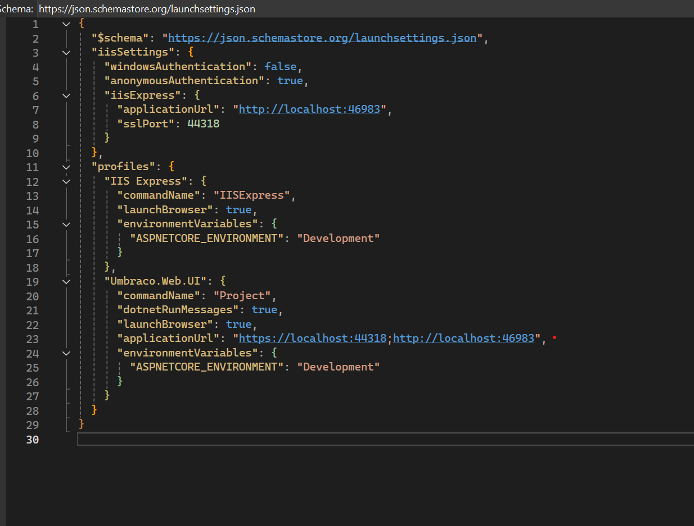

## Installation

1. Open your terminal and navigate to the `Client\assets` folder.
2. Execute the command `npm install` to install all necessary dependencies.

## Development

Testing local changes means running an Umbraco 14+ website against the projects in this repository instead of against the released NuGet package.

### 1. Reference the projects

In your Umbraco website:

1. If the website already references the `Enterspeed.Source.UmbracoCms` NuGet package, remove that `PackageReference` - otherwise the released package and these projects would both be referenced. A newly created website will not have it.
2. Add a `ProjectReference` to **both** `Enterspeed.Source.UmbracoCms.V14Plus` **and** `Enterspeed.Source.UmbracoCms.Base`.

   `Base` has to be referenced explicitly. `Enterspeed.Source.UmbracoCms.V14Plus` references it with `PrivateAssets="all"` so the `CopyProjectReferencesToPackage` target can bundle `Base.dll` into the NuGet package, which also means it does not flow on to a project that references `V14Plus`.

3. Rebuild the website. Swapping a `PackageReference` for a `ProjectReference` usually needs a full rebuild before the assemblies are picked up.

### 2. Make App_Plugins available

The NuGet package copies the client assets into the consuming website through `build/Enterspeed.Source.UmbracoCms.targets`. MSBuild only applies a package's `build` targets for a `PackageReference`, so with a project reference **nothing is copied and the Enterspeed dashboards will not load at all** - `/App_Plugins/Enterspeed.Source.UmbracoCms/umbraco-package.json` returns 404.

Link the folder instead, so the built assets are served straight out of this repository. Run once:

```
mklink /J "<your-umbraco-website>\App_Plugins\Enterspeed.Source.UmbracoCms" "<this-repository>\src\Enterspeed.Source.UmbracoCms.V14Plus\wwwroot\App_Plugins\Enterspeed.Source.UmbracoCms"
```

`App_Plugins` belongs at the root of your Umbraco project, next to `wwwroot`, not inside it. The target folder must not already exist - if the NuGet package was previously installed it will have left a copy of the assets behind, so delete that folder first. Copying the folder by hand works too, but has to be repeated after every frontend build, because the compiled filenames are content hashed and change with the content.

### 3. Run

1. Run `npm run watch` in `Client\assets`.

   This command monitors your files for changes, automatically compiles, and moves them to the `wwwroot` folder in the `Enterspeed.Source.UmbracoCms.V14Plus` project.

2. Launch your Umbraco website and log in to the backoffice.

**Work with `Disable cache` ticked in the browser's network tools, and leave the tools open.** `umbraco-package.json` points at `assets.js`, which is the only file whose name never changes - every other compiled file is content hashed. A cached `assets.js` therefore keeps importing the file names it was built with, so your changes silently never appear and the dashboards keep working from the previous build. Clearing site data does not necessarily help, because it leaves the HTTP cache in place.

To check which build the browser is actually running, look for `assets.js` in the network tools. If it says it came from cache rather than returning 200 or 304, that is the problem.

Changes to C# need the website rebuilt and restarted.

If the dashboards do not show up at all, check that `/App_Plugins/Enterspeed.Source.UmbracoCms/umbraco-package.json` returns 200 - a 404 means step 2 is missing.

### Good to know

- When building `Enterspeed.Source.UmbracoCms.V14Plus` directly, build it with `-f net8.0`. The other target frameworks regenerate `appsettings-schema.Umbraco.Cms.json` and `umbraco-package-schema.json` against a different Umbraco version, which produces a very large and unrelated diff. Those two files are development time IntelliSense helpers and are not part of the published package.

## Additional Information

All types are auto-generated based on the API specs from `Enterspeed.Source.UmbracoCMS.V14PLUS`.
To generate new types after recent API changes, run the following command:

- `npm run generate`.

**Important**

The command points at the path `http://localhost:46983/umbraco/swagger/enterspeed/swagger.json`.

Please make the `http://localhost:46983/` path available in your launch settings for your Umbraco project so your Umbraco installation is available at that URL. This is a workaround until we have a better solution.



## Building for Production

To prepare the project for production, run the command `npm run build`.
